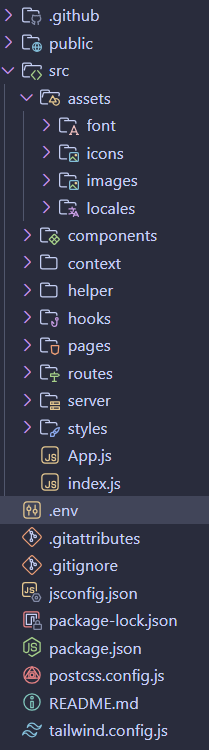

# 🎯 Site Administrateur ( Version : Juin 2024)

## 📖 Description  
**Objectif** : Le but principal de ce site administrateur est de fournir une interface conviviale pour gérer les différents aspects d'un site web ou d'une application. Il permet aux administrateurs de surveiller, configurer et maintenir les fonctionnalités du site de manière efficace.       
**Besoin** : Ce projet répond au besoin de centraliser la gestion des contenus, des utilisateurs, des paramètres et des performances d'un site web. Il facilite le travail des administrateurs en leur offrant un accès rapide et intuitif à toutes les fonctionnalités nécessaires.        
**Contexte** : Ce projet a été réalisé dans le cadre d'un projet d'entreprise pour répondre aux besoins spécifiques de notre organisation. Il vise à améliorer l'efficacité opérationnelle et à offrir une meilleure expérience utilisateur aux administrateurs du site.        

## 🚀 Fonctionnalités principales
- **Gestion des utilisateurs :** Ajouter, modifier ou supprimer des utilisateurs, gérer les rôles et les permissions.
- **Gestion des contenus :** Créer, éditer et publier des articles, des pages ou d'autres types de contenu.
- **Surveillance des performances :** Suivre les statistiques d'utilisation, les performances du site et les logs d'activité.
- **Configuration du site :** Modifier les paramètres généraux du site, les options de sécurité et les préférences d'affichage.
- **Sauvegarde et restauration :** Effectuer des sauvegardes régulières du site et restaurer les données en cas de besoin.

## 🛠️ Technologies utilisées
- [⚡️ React.js] : Pour créer une interface utilisateur dynamique et réactive.
- [⚡️ Tailwind CSS] : Pour styliser l'application de manière rapide et efficace grâce à un framework utilitaire CSS.
- [📱 Node.js] : Pour gérer le serveur backend et les API.
- [🔄 API CRUD] : Pour gérer les opérations de création, lecture, mise à jour et suppression des données via une interface backend.
- [🔒 Authentification JWT] : Pour sécuriser l'accès à l'interface administrateur.

## 🚀 Packages principaux utilisés

Voici une liste des packages clés utilisés dans ce projet :

### Dependencies
- **@cyntler/react-doc-viewer** : Pour visualiser des documents dans une application React.
- **@sentry/cli** : Outil en ligne de commande pour Sentry, utilisé pour surveiller et déboguer les erreurs.
- **@sentry/react** : Intégration de Sentry pour les applications React afin de capturer les erreurs.
- **axios** : Client HTTP basé sur des promesses pour faire des requêtes API.
- **cross-env** : Permet de définir des variables d'environnement indépendamment du système d'exploitation.
- **date-fns** : Bibliothèque pour manipuler et formater les dates en JavaScript.
- **draft-js** : Framework de Facebook pour construire des éditeurs de texte enrichi dans React.
- **draftjs-to-html** : Convertit le contenu Draft.js en HTML.
- **file-saver** : Pour enregistrer des fichiers sur le côté client.
- **fuse.js** : Moteur de recherche rapide et léger pour les applications JavaScript.
- **nodemon** : Outil de développement pour redémarrer automatiquement l'application Node.js lorsque des modifications de fichiers sont détectées.
- **prop-types** : Pour la vérification de type des props dans les composants React.
- **react** : Bibliothèque JavaScript pour construire des interfaces utilisateur.
- **react-datepicker** : Composant de sélection de date pour React.
- **react-dom** : Paquet pour travailler avec le DOM dans React.
- **react-draft-wysiwyg** : Éditeur WYSIWYG basé sur Draft.js pour React.
- **react-pdf** : Pour afficher des fichiers PDF dans une application React.
- **react-phone-number-input** : Composant pour l'entrée de numéros de téléphone internationaux.
- **react-responsive** : Composants pour gérer les mises en page réactives dans React.
- **react-router-dom** : Routage pour les applications React.
- **react-toastify** : Notifications toast pour les applications React.
- **sass** : Préprocesseur CSS pour écrire un CSS plus maintenable.
- **styled-components** : Pour utiliser des composants CSS-in-JS dans React.

### DevDependencies
- **autoprefixer** : Pour ajouter automatiquement les préfixes des fournisseurs aux règles CSS.
- **postcss** : Outil pour transformer le CSS avec des plugins JavaScript.
- **react-scripts** : Configuration par défaut pour les projets React.
- **tailwindcss** : Framework utilitaire CSS pour construire rapidement des designs personnalisés.

## 📂 Structure du projet
La structure du projet suit une organisation modulaire et claire afin de faciliter le développement, la maintenance et l'extensibilité. Voici un aperçu des principaux dossiers et fichiers du backend :

 

[Retour à la documentation principale](../../README.md)

