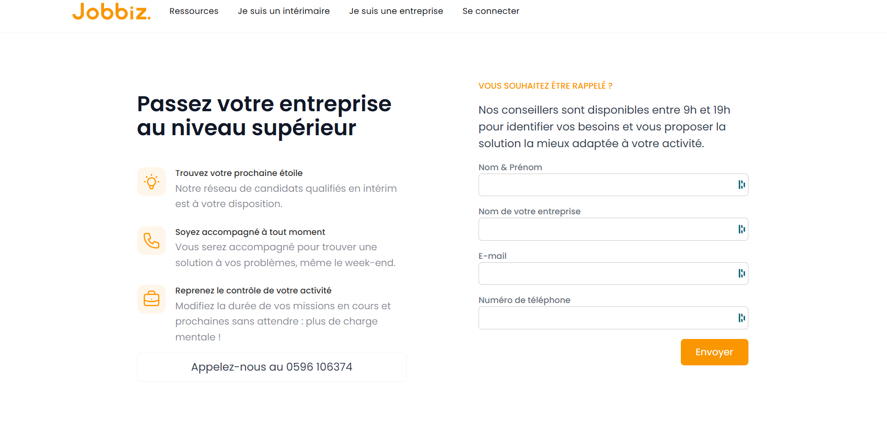
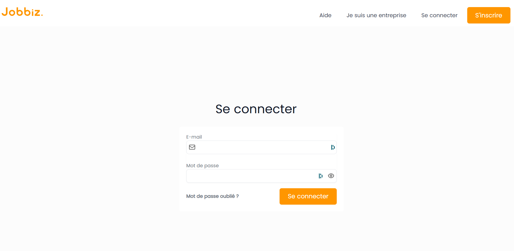
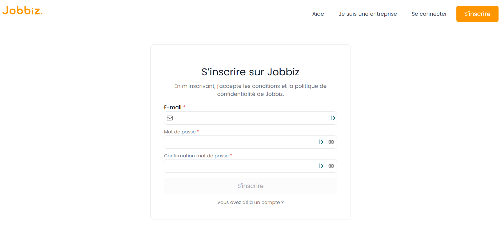

# 🎯 Portail de connexion/ Inscription ( Version : Juin 2024)

## 📖 Description  
Ce projet vise à simplifier et sécuriser l'accès aux différentes plateformes de Jobbiz pour les entreprises et les intérimaires. Grâce à un portail de connexion unique, les utilisateurs peuvent se connecter et être automatiquement redirigés vers l'interface qui leur est destinée en fonction de leur rôle.

Le portail inclut également une fonctionnalité d'inscription en plusieurs étapes pour les nouveaux utilisateurs, avec une validation par email et un contrôle avancé des mots de passe. Pour les entreprises, une option permet de demander une démonstration de la solution via un formulaire dédié, facilitant ainsi la prise de contact avec un commercial.

## 🚀 Fonctionnalités principales  
✅ [Connexion](#connexion)  
✅ [Inscription](#inscription)  
✅ [Demande de démo pour les entreprises](#demande-de-demo)

## 🛠️ Technologies utilisées  

### Front End
- Javascript
- React JS
- Tailwind CSS

### Back End
- Node JS

## 📸 Aperçu  
 

 

 

## Connexion
**Description** : Lors de la connexion, l'utilisateur saisit ses identifiants. L'API authentifie l'utilisateur et retourne un token JWT contenant son rôle. Ce token est stocké (localStorage ou sessionStorage) et utilisé pour rediriger automatiquement l'utilisateur vers le site correspondant à son rôle (entreprise ou intérimaire).      
**Pourquoi** : Cela garantit une authentification sécurisée, réduit le risque d'accès non autorisé et améliore l'expérience utilisateur en redirigeant chaque personne vers l'interface qui lui est destinée.

## Inscription
### Vérification de l'email

**Description** : Lors de l'inscription, l'email de l'utilisateur est vérifié pour s'assurer qu'il est valide et qu'il n'a pas déjà été utilisé dans le système.        
**Pourquoi** : Cela permet d'éviter les doublons et d'assurer la validité des comptes utilisateurs. Si un compte existe déjà, l'utilisateur est invité à se connecter ou à récupérer son mot de passe.

### Vérification de la solidité du mot de passe

**Description** : Lors de la saisie du mot de passe, un encadré s'affiche avec des indications et un système de validation.     
**Pourquoi** : Cela garantit que le mot de passe respectera un niveau minimal de sécurité.

Conditions de validation :
- Au moins 8 caractères   
- Au moins une majuscule  
- Au moins une minuscule  
- Au moins un caractère spécial   
- Au moins un chiffre (0-9)  

### Création du compte utilisateur

**Description** : Après validation de son email, l'utilisateur complète son inscription via un formulaire en plusieurs étapes, où il renseigne ses informations personnelles (nom, prénom, etc.).   
**Pourquoi** : Ce processus structuré facilite l'inscription en guidant l'utilisateur étape par étape, tout en garantissant la collecte des informations nécessaires et la sécurité de son compte.

### Validation par email

**Description** : Un email de confirmation contenant un token unique est envoyé à l'utilisateur pour valider son inscription et activer son compte.     
**Pourquoi** : Cela ajoute une couche de sécurité pour s'assurer que l'email appartient bien à l'utilisateur.

### Gestion des erreurs

**Description** : Si une erreur survient (email déjà utilisé, mot de passe trop faible, etc.), des messages d'erreur clairs sont affichés pour guider l'utilisateur.    
**Pourquoi** : Cela améliore l'expérience utilisateur en rendant le processus d'inscription plus fluide et sans confusion.

## Demande de Demo
**Description** : Permet à une entreprise de demander une démonstration personnalisée de la solution par un commercial.     
**Pourquoi** : Cela permet à l'entreprise de mieux comprendre les fonctionnalités de la solution, d'évaluer son adéquation avec leurs besoins spécifiques, et de poser toutes les questions avant de prendre une décision.

## 🔗 Lien vers le projet  
🌍 [Voir le projet en ligne](https://login.jobbiz.fr)  

[Retour à la documentation principale](../../README.md)

